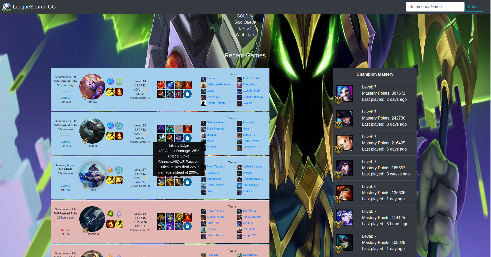

### [LeagueSearch.GG](https://pedantic-bhaskara-90beb7.netlify.com/#/)

Hosted on [Netlify and Heroku](https://pedantic-bhaskara-90beb7.netlify.com/#/).

This is a Summoner information query, much like [Op.gg](https://na.op.gg/) and [Porofessor.gg](https://porofessor.gg/). Built in React.js and features fully dynamic rendering of information. Different css based on if viewed through mobile, tablet, or desktop as well.




### Quickstart guide

run
```
npm i
```

get your developer key from [Riot games](https://developer.riotgames.com/)

rename the `.env.example` file to `.env` and fill it with the key. Note that the developer key must be regenerated every 24hrs unless it is registered as a product.


start the server with 
```
npm run local
```
and start the front-end with 

```
npm start
```

Navigate and view your site [Here](http://localhost:3000/#/)

### Futher Notes

The backend can be hosted seperately. To do this, simply host the backend and give your `.env` `REACT_APP_BACKEND_URL` the url to the hosted domain. Leave that url blank otherwise.